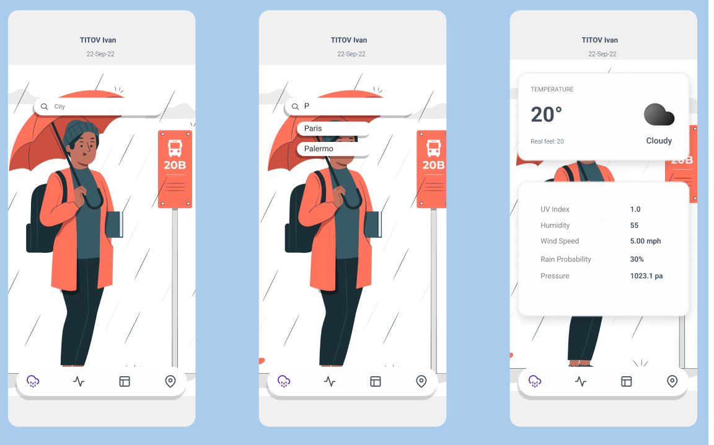
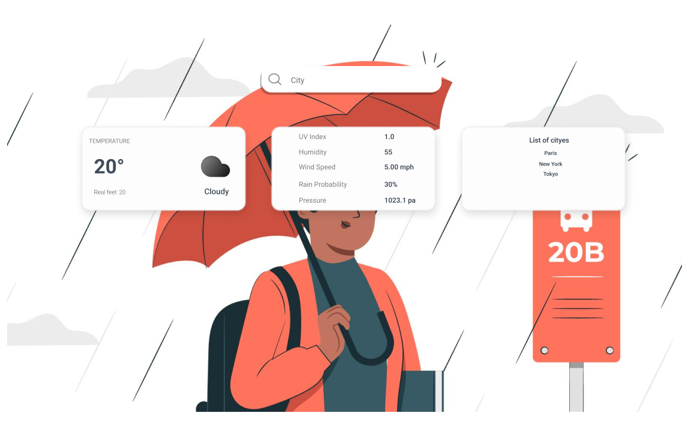

This project was bootstrapped with [Create React App](https://github.com/facebook/create-react-app), using the [Redux](https://redux.js.org/) and [Redux Toolkit](https://redux-toolkit.js.org/) template.

## Available Scripts

In the project directory, you can run:

### `npm start`

Runs the app in the development mode. 
Open [http://localhost:3000](http://localhost:3000) to view it in the browser.

The page will reload if you make edits. 
You will also see any lint errors in the console.

### `npm run build`

Builds the app for production to the `build` folder. 
It correctly bundles React in production mode and optimizes the build for the best performance.

The build is minified and the filenames include the hashes. 
Your app is ready to be deployed!

# Meteo app

<h2>Objectifs du projet</h2>

<ul>
  <li>Maquetter les interfaces de saisies et de consultations.</li>
  <li>Création d’une application web en utilisant de RactJS/ ReduxJs.</li>
  <li>Création le fetch request</li>
  <li>Utilisation d’une API.</li>
  <li>Publication de front-end.</li>
  <li>Réalisation de tests fonctionnels.</li>
  <li>Réalisation de tests fonctionnels.</li>
</ul> 

### `Layout`

 

